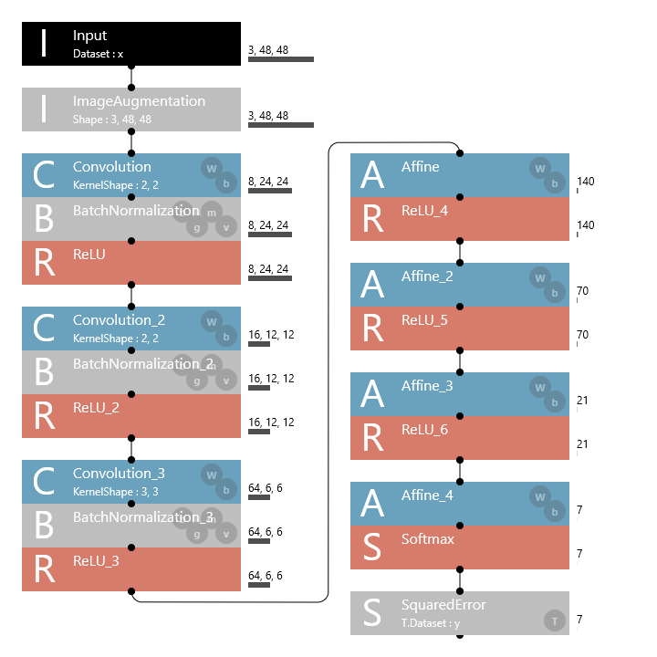

# vividface

[Neural Network Console](https://dl.sony.com/) と [Neural Network Libirary](https://nnabla.org) を使用して、キャラクター推定を行うサンプルです。

> キャラクターの顔検出については別のライブラリを使用しています。

## 動作確認環境
* Neural Network Console 1.6.0
* Python 3.6.10
  * bottle 0.12.18
  * nnabla 1.5.0
  * nnabla-ext-cuda101 1.5.0
  * numpy 1.18.1
  * Pillow 7.0.0
  * OopenCV 3.4.2

### Neural Network Consoleで作成するネットワークについて


### lbpcascade_animeface

画像からアニメキャラクターの抽出を行うのに、[lbpcascade_animeface](https://github.com/nagadomi/lbpcascade_animeface)を使用しています。

必要に応じてダウンロードしたものを、Pythonスクリプトと同じ場所に配置してください。

## データセットについて
データセットについては含めてません。

48x48ドットのRGB画像24bitをキャラクター毎に100枚づつ、それぞれのフォルダに配置して学習を行います。

100枚の内訳は学習用に80枚、評価用に20枚となります。フォルダに100枚以上の画像が収められていても100枚しか取得しません。

それ以上のサイズを読み込ませたい場合は、LOAD_SIZEやBATCH_SIZEを修正してください。

## Neural Network Library
### vividface_nnl.pyの使用方法

学習は以下のコマンドで実行します。
```
python vividface_nnl.py
```
学習は10000epoch行い10epoch毎に評価を行います。

評価を行った際に、キャラクター別の正解率がMIN_SAVE_SCORE以上になった場合は、vividface_nnl_modelフォルダに学習結果を保存します。

vividface_nnl.pyを実行すると、データセットフォルダ内に以下の二つのCSVファイルが生成されます。
* vividface_train_48x48.csv
* vividface_valid_48x48.csv

このファイルはNeural Network ConsoleのDatasetとしてそのまま使用する事が出来ます。

### vividface_nnl_web.pyの使用方法

学習結果を確認するにはMODEL_PATHNAMEにvividface_nnl_modelフォルダ内のh5ファイルを指定し、以下のコマンドを実行する事でローカルにウェブサーバーが立ち上がります。
```
python vividface_nnl_web.py
```

ブラウザで http://127.0.0.1:8001/ を開き、フォームから画像をアップロードすると、animefaceによる顔検出と学習結果を元にしたキャラクター推定を行います。

推論と推論結果の表示に使用した画像は、imworkフォルダに保存されます。

推論を実行する毎にファイルが増えていくので、気になる場合はAUTO_IMWORK_CLEANをTrueにすることで、推論を実行する度にIMWORK_EXPIRE_SECよりも古いファイルを削除します。

## Neural Network Console
### vividface_nnc.pyの使用方法

Neural Network Consoleで学習が完了したら、TrainingかEvaluation画面からNNPファイルをエクスポートします。
```
Export > NNP (Neural Network Libraries file format)
```
エクスポートしたmodel.nnpファイルはvividface_nnc_modelフォルダにコピーします。

以下のコマンドを実行すると、model.nnpファイル内のネットワーク構造と学習結果を読み取って推論を行います。

vividface_nnl.pyと違い、評価と推論のみを行います。
```
python vividface_nnc.py
```

### vividface_nnc_web.pyの使用方法

学習結果を確認するには以下のコマンドを実行する事でローカルにウェブサーバーが立ち上がります。

動作や設定はvividface_nnl_web.pyと同じです。

```
python vividface_nnc_web.py
```
